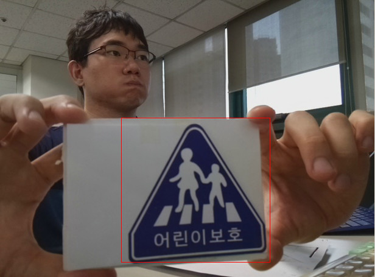
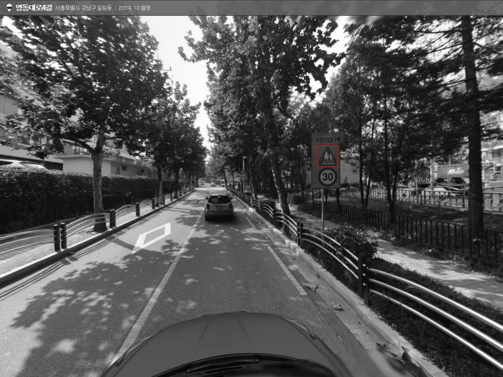
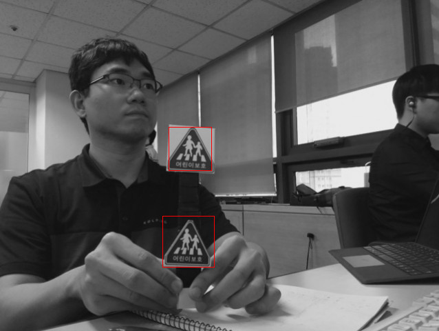

Bit Autonomous RC Car Project 
======================

Note: this repository was created for the final project of bit IoT embedded system developer course and won't receive any major updates. Still, you can use this repository as a study reference or for some practical purposes.

| junghwk | yeogue | jaebum44 | desung7 |
| :---: | :---: | :---: | :---: |
| OpenCV | OpenCV | OpenCV | OpenCV |
| dlib | dlib | device driver | dlib |
| dlib | dlib | device driver | dlib |


## Table of content

- [Introduction](#introduction)
    - [Development Environment](#development-environment)
    - [Block Diagram](#block-diagram)
    - [Flow Chart](#flow-chart)
    
- [Computer Vision](#computer-vision)
    - [OpenCV](#openCV)
    - [dlib](#dlib)
        * [Install](#install)
        * [Build](#build)
        * [Mark signs on Images](#mark-signs-on-images)
        
    
- [Device Driver](#device-driver)
    - [Upload the page tree file](#upload-the-page-tree-file)
    - [Go to the import view](#go-to-the-import-view)
    - [Import the uploaded page tree file](#import-the-uploaded-page-tree-file)

- [](#license)

- [Links](#links)

## Introduction

### Development Environment

line detection
* Log into the TYPO3 back end
* Click on ''Admin Tools::Extension Manager'' in the left navigation
* Click the icon with the little plus sign left from the Aimeos list entry (looks like a lego brick)
* If a pop-up opens (only TYPO3 4.x) choose ''Make updates'' and "Close window" after the installation is done

**Caution:** Install the **RealURL extension before the Aimeos extension** to get nice looking URLs. Otherwise, RealURL doesn't rewrite the parameters even if you install RealURL afterwards!
<https://github.com/opencv/opencv>

### Block Diagram


### Flow Chart


## OpenCV

line detection
* Log into the TYPO3 back end
* Click on ''Admin Tools::Extension Manager'' in the left navigation
* Click the icon with the little plus sign left from the Aimeos list entry (looks like a lego brick)
* If a pop-up opens (only TYPO3 4.x) choose ''Make updates'' and "Close window" after the installation is done

**Caution:** Install the **RealURL extension before the Aimeos extension** to get nice looking URLs. Otherwise, RealURL doesn't rewrite the parameters even if you install RealURL afterwards!
<https://github.com/opencv/opencv>

## dlib

We've trained our own traffic sign detector using dlib and its implementation of the Felzenszwalb's version of the Histogram of Oriented Gradients (HoG) detector. The training examples used in this repository are from Korean road signs, but the classifier should work with any traffic signs, as long as you train it properly. We used Naver Map images, several captures from webcam and etc. Just note that there are methods with better results than HoG for traffic sign detector, such as Deep Learning architectures. 

### Install

```
git clone https://github.com/davisking/dlib.git
```

### Build

```
sudo su
cd dlib/example
mkdir build
cd build 
cmake .. -DUSE_AVX_INSTRUCTIONS=1
cmake --build . --config Release
```

if an example requires GUI, check this macro below to DLIB_NO_GUI_SUPPORT=OFF and confirm in CMakeLists.txt
```
macro(add_gui_example name)
   if (DLIB_NO_GUI_SUPPORT=OFF)
      message("No GUI support, so we won't build the ${name} example.")
   else()
      add_example(${name})
   endif()
endmacro()
```

### Mark signs on images

1. Compile `imglab`:

```
cd dlib/tools/imglab
mkdir build
cd build
cmake ..
cmake --build .
```

2. Create XML from sample images:

```
dlib/tools/imglab/build/imglab -c training.xml /path/to/dir/train
dlib/tools/imglab/build/imglab training.xml
dlib/tools/imglab/build/imglab -c testing.xml /path/to/dir/test
dlib/tools/imglab/build/imglab testing.xml
```

3. Use `shift+click` to draw a box around signs.



**Note:** If you want to use different aspect ratios, then make all your truth boxes have the same or nearly the same aspect ratio. You can access those parameters in your training code like this below. 

``` 
scanner.set_detection_window_size(80, 80);  
``` 

**Note:** Your training code will throw an exception if it detects any boxes that are impossible to detect given your setting of scanning window size and image pyramid resolution. If you want to discard these impossible boxes automatically from your training data, then use a statement like below before running the trainer.

```
remove_unobtainable_rectangles(trainer, images_train, face_boxes_train);   
```

**Note:**  To add more image metadata to your XML datasets, use this statement like this below. It will add the image metadata from <arg1> into <arg2>. If any of the image tags are in both files then the ones in <arg2> are deleted and replaced with the image tags from <arg1>. The results are saved into merged.xml and neither <arg1> or <arg2> files are modified. Use -h option for more details.  

```
./imglab --add <arg1> <arg2>
```
        
        
### Train the fHOG_object_detector

To train a fHOG_object_detector, run `fhog_object_detector ex`. For example, to run the detector on the `/dir/image` folder with your XML datasets.  

```
dlib/example/build/fhog_object_detector_ex /path/to/dir/image
```

The detector will show test images with marks on and your results will be saved into the file `*svm`.






### How to use your own models in your project 

1. How to compile:

```
cd dlib/example/
cp fhog_object_detector_ex.cpp my_fhog_object_detector.cpp
g++ -std=c++11 -O3 -I.. ../dlib/all/source.cpp -lpthread -lX11 -DDLIB_JPEG_SUPPORT -ljpeg my_fhog_object_detector.cpp -o my_fhog_ex `pkg-config --cflags --libs opencv` -DUSE_SSE2_INSTRUCTIONS=ON -DUSE_AVX_INSTRUCTIONS=ON -DUSE_SSE4_INSTRUCTIONS=ON
```

2. How to recall detector.svm in your training code:

```
dlib::object_detector<image_scanner_type> detector;
dlib::deserialize("my.svm") >> detector;
```

**Note:**  This format is crucial. `*_ex` 

**Note:**  To compile using `cmake` in dir/build, make your own customized CMakeLists.txt 

## motor control


## device driver


## TCP/IP network


## schedule management

project planning of team

write journal

<https://drive.google.com/open?id=181hj2BIQw41JlRvIvNAiyvcg5SGY2thXSMtJz_hX9zQ>

